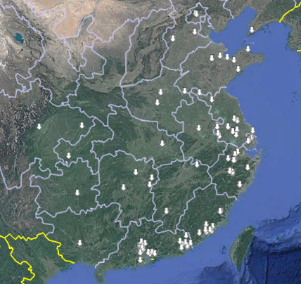

# Convert Text Addresses to Geographic Coordinates on a Map

[English Version](README_EN.md) | [中文版](README.md)
  ature Verification", read and agree to the terms, then click "Add".  
   - After successfully creating the key, click ["Quota Management -> Account Limit"](https://lbs.qq.com/dev/console/quota/account), scroll to the second page(If you have translated the web page, there may be display problems here. Just select the fourth line), and click "Quota Allocation" under "Geocoding." Click quota allocation(below the "operate" col) for your newly created key and set an appropriate value (the default concurrency for this program is 5 requests per second), then submit.  
   - Go back to [Application Management → My Apps](https://lbs.qq.com/dev/console/application/mine), copy the **Key**, then click **"Edit"** and copy the **Secret Key**.  

2. **Configure the API Key**  
   - Download and unzip AddressMapper.zip from release.
   - In `tencent_api.txt`:  
     - First line: Paste the **Key** from Tencent Location Service.  
     - Second line: Paste the **Secret Key**.  

   **Example**:  

   JIRBZ-U2D3Z-JJPXW-7FHM4-BIPB6-ABCDE  
   ketYpUGiZRIWFzr7Ow5W05GmXFABCDE  

4. **Prepare the Data File**  
   - Save address information in `1.xlsx`.  
   - The format should match `Example.xlsx`:  
     - First column: Company name  
     - Second column: Company address  
     - Third column: Contact person (optional, can be left blank)  

5. **Run the Program**  
   - Double-click `AddressMapper.exe`, and the program will automatically generate a KML file.  

6. **View the Results**  
   - Install [**Google Earth Pro**](https://support.google.com/earth/answer/168344#zippy=%2Cdownload-google-earth-pro-directly) and open the KML file with it.  
   - Alternatively, import the KML file in the [web version](https://earth.google.com/web) or [mobile app](https://play.google.com/store/apps/details?id=com.google.earth) of **Google Earth**.  
   - For users in China, [Ovital Maps](https://www.ovital.com/download/) is a better alternative.  

  
